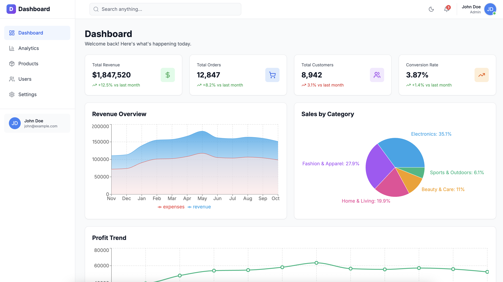
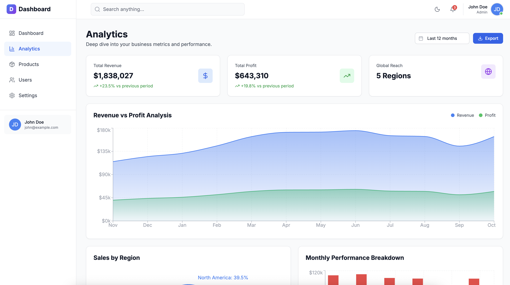

<div align="center">

# 📊 Modern Dashboard

### A Beautiful, Responsive Analytics Dashboard


[Demo](#demo) • [Features](#features) • [Installation](#installation) • [Documentation](#project-structure)

</div>

---

## 🎯 Overview

**Modern Dashboard** is a production-ready, feature-rich analytics dashboard built with cutting-edge web technologies. It provides an elegant interface for visualizing business metrics, tracking KPIs, and analyzing data trends with interactive charts and responsive design.

Perfect for startups, SaaS applications, or any project requiring a professional admin panel.

## ✨ Features

### 🎨 **Modern UI/UX**
- Clean, minimalist design with smooth animations
- Dark mode support with seamless theme switching
- Responsive layout that works on all devices (mobile, tablet, desktop)
- Hover effects and scale animations on interactive elements

### 📊 **Data Visualization**
- Interactive charts powered by Recharts (Area, Line, Pie, Composed)
- Real-time data updates with animated counters
- Customizable stat cards with trend indicators
- Multiple chart types for different data representations

### 🚀 **Performance & Developer Experience**
- Lightning-fast development with Vite HMR
- Type-safe codebase with TypeScript
- Modular component architecture
- ESLint + Prettier for code quality
- Optimized production builds

### 🎯 **Key Components**
- **Dashboard**: Overview with revenue, orders, customers, and conversion metrics
- **Analytics**: Deep-dive analytics with revenue vs profit, regional sales, and performance breakdowns
- **Products**: Product management with filtering and search
- **Reusable Card Component**: Unified, modular card system with StatCard functionality built-in

## 📸 Screenshots

> **Note**: Add your screenshots to the `/docs/screenshots/` directory

<div align="center">

### Dashboard Overview

*Main dashboard with KPI cards and revenue charts*

### Analytics Page

*Detailed analytics with regional sales and performance metrics*

### Dark Mode

*Beautiful dark theme for reduced eye strain*

</div>

## 🛠️ Technologies Used

### Frontend


### Styling & UI


### Data Visualization


### Build Tools & Dev


## 🚀 Getting Started

### Prerequisites

- **Node.js** 18.x or higher
- **npm** 9.x or higher (or **yarn** / **pnpm**)

### Installation

1. **Clone the repository**
   ```bash
   git clone https://github.com/yourusername/modern-dashboard.git
   cd modern-dashboard
   ```

2. **Install dependencies**
   ```bash
   npm install
   ```

3. **Start the development server**
   ```bash
   npm run dev
   ```

4. **Open your browser**
   
   Navigate to `http://localhost:5173`

### Build for Production

```bash
# Create optimized production build
npm run build

# Preview production build locally
npm run preview
```

The build output will be in the `dist/` directory, ready to deploy.

## 📁 Project Structure

```
modern-dashboard/
├── public/                  # Static assets
├── src/
│   ├── components/          # Reusable components
│   │   ├── ui/             # UI components (Card, Button, etc.)
│   │   │   └── Card.tsx    # Unified Card component with StatCard functionality
│   │   ├── Layout.tsx      # Main layout wrapper
│   │   ├── Sidebar.tsx     # Navigation sidebar
│   │   ├── ThemeToggle.tsx # Dark mode toggle
│   │   └── Skeleton.tsx    # Loading skeletons
│   ├── pages/              # Page components
│   │   ├── Dashboard.tsx   # Main dashboard page
│   │   ├── Analytics.tsx   # Analytics page
│   │   ├── Products.tsx    # Products page
│   │   └── Settings.tsx    # Settings page
│   ├── data/               # Mock data
│   │   └── mockData.ts     # Sample data for charts
│   ├── utils/              # Utility functions
│   │   └── formatters.ts   # Number/currency formatters
│   ├── App.tsx             # Root component with routing
│   ├── index.css           # Global styles
│   └── main.tsx            # Application entry point
├── docs/
│   └── screenshots/        # Add your screenshots here
├── .eslintrc.cjs           # ESLint configuration
├── .prettierrc             # Prettier configuration
├── tailwind.config.js      # Tailwind CSS configuration
├── tsconfig.json           # TypeScript configuration
├── vite.config.ts          # Vite configuration
├── vercel.json             # Vercel deployment config
└── package.json            # Dependencies and scripts
```

## 📜 Available Scripts

| Command | Description |
|---------|-------------|
| `npm run dev` | Start development server with HMR |
| `npm run build` | Build for production |
| `npm run preview` | Preview production build locally |
| `npm run lint` | Run ESLint to check code quality |
| `npm run lint:fix` | Auto-fix ESLint issues |
| `npm run format` | Format code with Prettier |
| `npm run format:check` | Check code formatting |

## 🌐 Demo

🚀 **Live Demo**: [https://your-dashboard.vercel.app](https://your-dashboard.vercel.app)

> Deploy your own instance to Vercel with one click:
> 
> [](https://vercel.com/new/clone?repository-url=https://github.com/yourusername/modern-dashboard)

## 🎨 Customization

### Theme Colors

Edit `tailwind.config.js` to customize the color palette:

```js
module.exports = {
  theme: {
    extend: {
      colors: {
        primary: '#3B82F6',
        secondary: '#10B981',
        // Add your custom colors
      }
    }
  }
}
```

### Adding New Pages

1. Create a new component in `src/pages/YourPage.tsx`
2. Add the route in `src/App.tsx`:
   ```tsx
   <Route path="/your-page" element={<YourPage />} />
   ```
3. Update sidebar navigation in `src/components/Sidebar.tsx`

### Card Component Usage

The unified `Card` component supports both standard cards and stat cards:

```tsx
// Standard Card
<Card hoverable>
  <h2>Your Content</h2>
</Card>

// Stat Card
<Card
  title="Total Revenue"
  value="$45,231"
  iconName="DollarSign"
  iconColor="green"
  hoverable
  trend={{ value: 12.5, isPositive: true }}
/>
```

## 🗺️ Roadmap

- [ ] **Authentication System** - User login/logout with JWT
- [ ] **Real API Integration** - Connect to backend services
- [ ] **Advanced Filtering** - Date range pickers, custom filters
- [ ] **Export Functionality** - CSV/PDF export for reports
- [ ] **User Management** - Admin panel for user roles
- [ ] **Notifications** - Real-time alerts and notifications
- [ ] **Multi-language Support** - i18n integration
- [ ] **Custom Themes** - Theme builder and presets
- [ ] **Mobile App** - React Native version

## 🤝 Contributing

Contributions are welcome! Please read our [Contributing Guide](CONTRIBUTING.md) for details on our code of conduct and the process for submitting pull requests.

## 📄 License

This project is licensed under the **MIT License** - see the [LICENSE](LICENSE) file for details.

## 🙏 Acknowledgments

- [Recharts](https://recharts.org/) for the amazing chart library
- [Lucide](https://lucide.dev/) for beautiful icons
- [Tailwind CSS](https://tailwindcss.com/) for the utility-first CSS framework
- [Vite](https://vitejs.dev/) for the blazing-fast build tool

---

<div align="center">

**Made with ❤️ by Your Team**

[⬆ Back to Top](#-modern-dashboard)

</div>
# Modern-Dashboard
